# Hi, Shriya here

<!--
**shriya9876/shriya9876** is a ✨ _special_ ✨ repository because its `README.md` (this file) appears on your GitHub profile.

Here are some ideas to get you started:

- 🔭 I’m currently working on ...
- 🌱 I’m currently learning ...
- 👯 I’m looking to collaborate on ...
- 🤔 I’m looking for help with ...
- 💬 Ask me about ...
- 📫 How to reach me: ...
- 😄 Pronouns: ...
- ⚡ Fun fact: ...
-->

Full-stack engineer building reliable, fast web apps.  
.NET 8, ASP.NET Core, Angular, Blazor, Azure SQL, Kafka, GitHub Actions.

<!--
**Portfolio** · **Resume** · **Email** · **LinkedIn**  
[your-portfolio-url] · [your-resume-url] · [you@domain.com] · [linkedin.com/in/you]
-->

---

## What I focus on
- **Backend:** .NET APIs, EF Core, SQL performance, clean architecture
- **Frontend:** Angular UI, component libraries, accessibility, testing
- **Cloud/DevOps:** Azure, CI/CD, containers, observability, cost efficiency

---

### Tech

---

## Highlights
- Cut API tail latency with caching, indexes, and async I/O
- Delivered WCAG-aligned UI with keyboard and screen reader support
- Hardened auth using OAuth2/OpenID Connect with secure flows
- Built observability: logs, metrics, and traces with actionable dashboards

---

---

